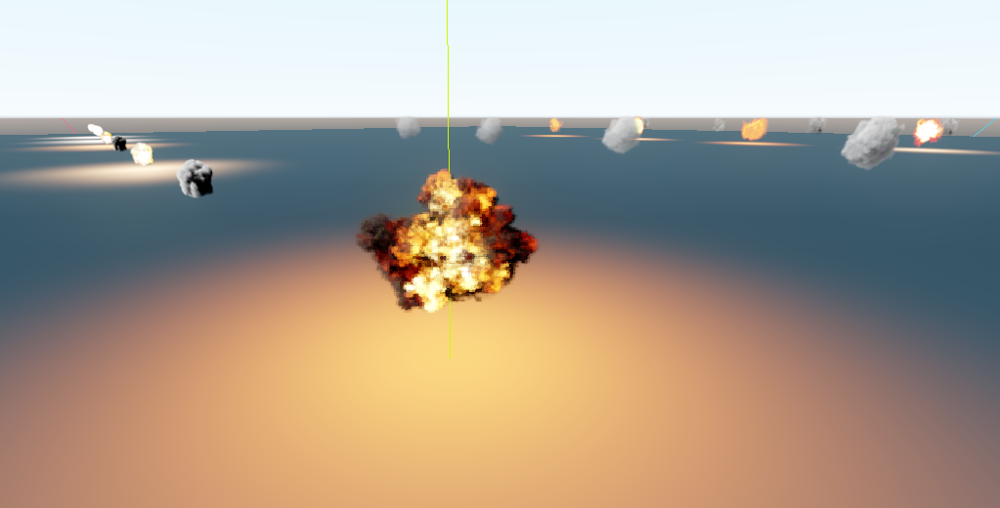

# General
Prerendered Flipbook Particle Effects for Godot's Asset Library.
* 19 Flipbook Effects
* 30+ FPS
* Explosion Particles
* Exploding Dust
* Looping Clouds
* Looping Fireballs
* Looping Smoke

# License
This repo is [AGPL-3.0](https://tldrlegal.com/license/gnu-affero-general-public-license-v3-(agpl-3.0)) licensed.

# Credit
| Asset | Source | License |
| ------ | ------ | ------ |
| Flipbook textures | [UnityBlog](https://blog.unity.com/technology/free-vfx-image-sequences-flipbooks) | CC0 1.0 Universal |

For an improved version at the cost of performance check out: [Flowmap smoothing](https://godotshaders.com/shader/particle-flipbook-flowmap-smoothing/)
